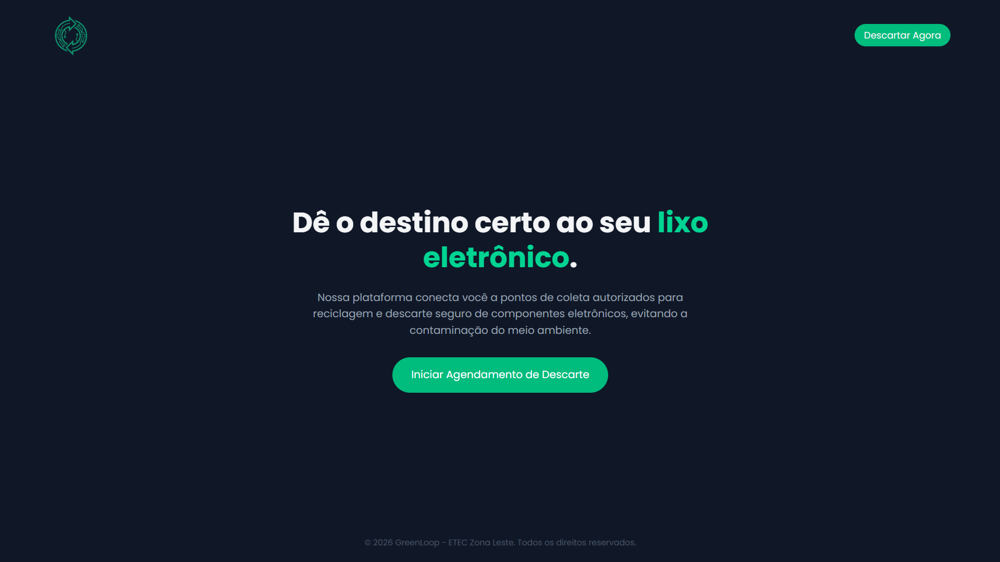
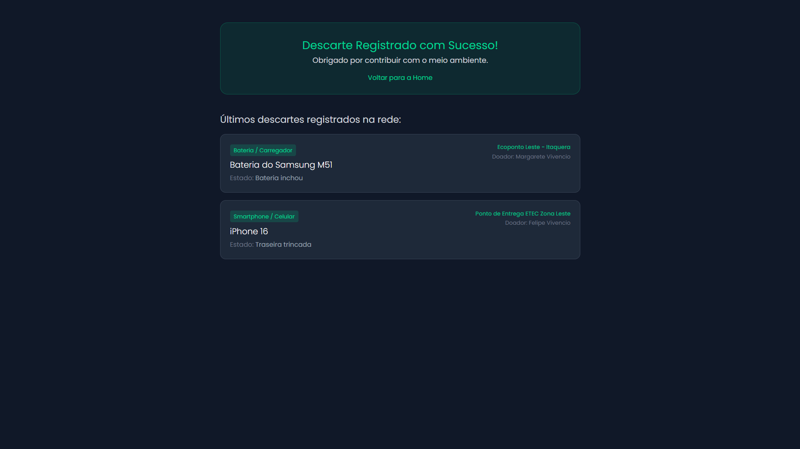
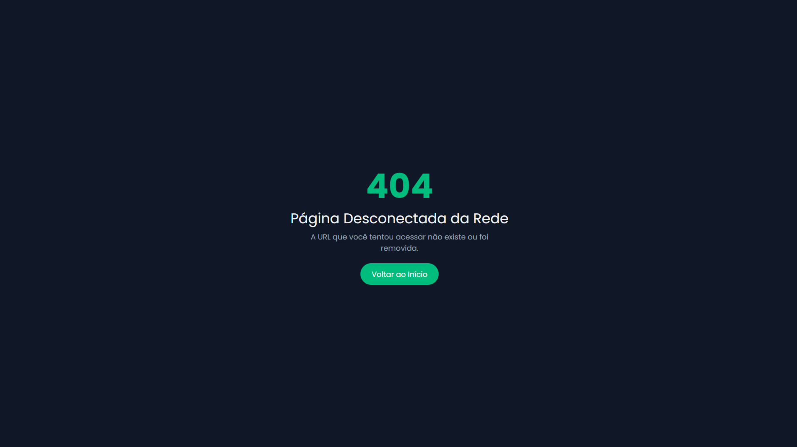

### GreenLoop - Rede de Logística Reversa de Eletrônicos

Este é um sistema desenvolvido em **Laravel** focado na sustentabilidade tecnológica, permitindo que usuários agendem o descarte inteligente de componentes eletrônicos em ecopontos parceiros.

---

## Requisitos Implementados

- **Rota Fallback:** Captura URLs inválidas e redireciona para uma página 404 personalizada integrada ao tema.
- **Migrations:** Modelagem e automatização da tabela `solicitacoes_descarte` no banco de dados.
- **Proteção CSRF:** Formulário protegido nativamente utilizando a diretiva `@csrf` contra ataques maliciosos.
- **Comnetários no Algoritmo:** Código documentado explicando os principais fluxos de inserção e validação.
- **Tema Individual:** Logística Reversa de Eletrônicos.

---

## Telas do Sistema (Views Publicadas)

### 1. Página Inicial (Home)



### 2. Formulário de Agendamento de Descarte
*Interface onde o cidadão informa os dados do eletrônico. Possui validação e proteção CSRF ativa.*


### 3. Confirmação e Listagem de Resíduos
*Exibe feedback de sucesso e lista em tempo real todos os descartes registrados no banco de dados através da migration.*


### 4. Página de Erro 404 (Rota Fallback)
*Tela customizada exibida automaticamente caso o usuário tente acessar uma rota inexistente.*


---

## Como Executar o Projeto Localmente

1. Clone o repositório:
```bash
   git clone [https://github.com/vlipe/atividades-3DS/edit/main/Programação%20Web%20III/2°%20Bimestre/logistica-reversa](https://github.com/vlipe/atividades-3DS/edit/main/Programação%20Web%20III/2°%20Bimestre/logistica-reversa.git)
